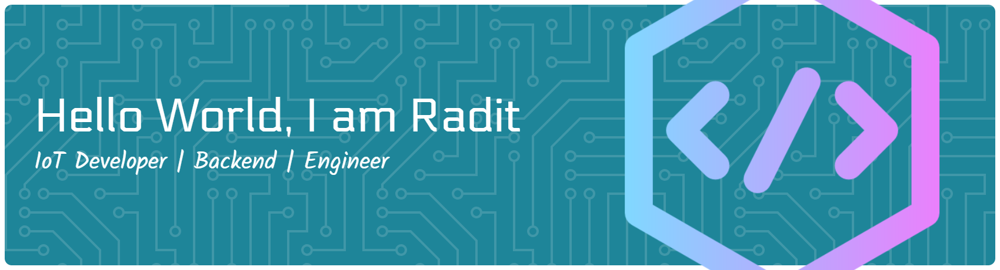

## 💫 About Me:
🎓 D4 Informatics Engineering Student

💻 Embedded Systems & IoT Developer

⚡ Passionate about building real-world projects with microcontrollers.

## 🌐 Connect WIth Me:
   

## 💻 Programming Skill:
       

## 👨‍💻 Other Skill:
                

## 📊 My Github Stats:
 
 

## My Bini 💕🗿
  
  
  

### ✍️ Random Dev Quote

---

<!-- Proudly created with GPRM ( https://gprm.itsvg.in ) -->